# 빅핑키 캐리어
> 빅핑키, 터틀봇, omx를 사용한 재난 구호 시스템
## 📌 프로젝트 개요
### 수행 기간
> 2026.05.26 ~ 
### 팀원
> |이름|역할|
> |------|------|
> |김권 |터틀봇 자율 주행 시스템 구성|
> |김동석 |터틀봇 주차 시스템 구성, 조난자 인식 모델 개발|
> |명지훈 |omx 동작 및 시스템 구현|
> |박준수 |관제 시스템 구현|
> |이경환 |시퀸스 구현|
> |최민석 |빅핑키 패키지 작성, 터틀봇 하드웨어 구성|
> |최민지 |빅핑키 하드웨어 구성|

### 목표
> - 터틀봇 자동 하차 및 건물 진입
> - 자율 맵핑 및 사람 감지
> - 구호 물품 자율 배달
> - 웹 서버에서 모니터링 및 제어
### 주요 기능
> - 마커 및 라인 트레이싱을 이용한 터틀봇 상하차
> - 프론티어 기반 자율 탐색을 이용한 실시간 지도 작성 및 조난자 인식
> - opencv를 이용하여 구급품 및 물을 omx를 통해 적재
> - FMS(Fleet Management System)을 통한 효율적인 터틀봇 제어 시스템

## ⚙️ 시스템 아키텍처

## 🎥 시연

### 경사로 제어

### 라인 트레이싱
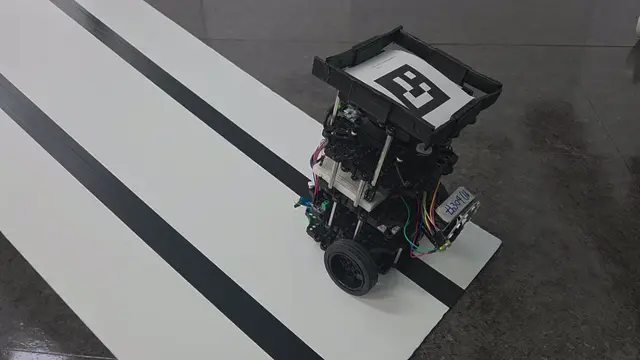

### 터틀봇 상차 및 주차
[auto_loading.webm](https://github.com/user-attachments/assets/35f7c49f-e6cc-4975-a01e-599cda26b8e8)

### 자율 맵핑 및 조난자 감지
[yolo_dashboard.webm](https://github.com/user-attachments/assets/32c18b7b-b848-4501-a7e7-fcd81c8a3fba)

### YOLO 요구조자 감지
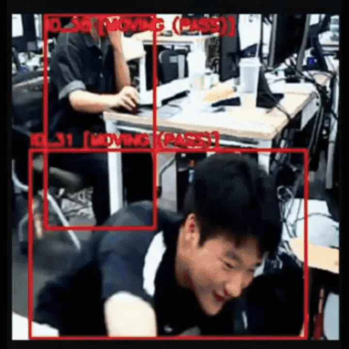

### OMX 시스템
[omx_dashboard.webm](https://github.com/user-attachments/assets/4a6fdc93-9bdd-4377-ab9f-23895cbfc3be)

### 관제 시스템
>  

>  <table>
>    <tr>
>      <td align="center" width="30%">
>        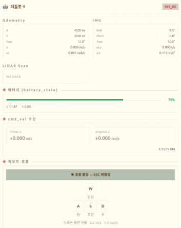 
>        <b>상태확인</b>
>      </td>
>      <td align="center" width="30%">
>        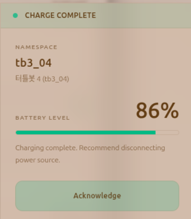 
>        <b>배터리 알림</b>
>      </td>
>      <td align="center" width="30%">
>        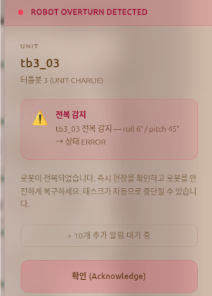 
>        <b>전복 알림</b>
>      </td>  
>    </tr>
>    <tr>
>      <td align="center" width="30%">
>        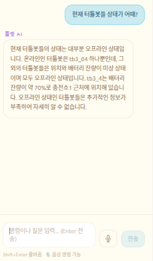 
>        <b>LLM + RAG</b>
>      </td>
>      <td align="center" width="30%">
>        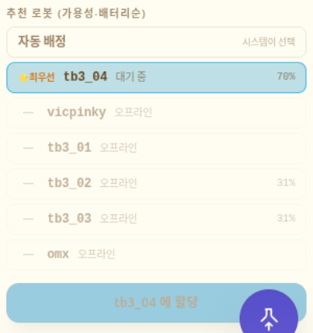 
>        <b>우선순위 지정</b>
>      </td>
>      <td align="center" width="30%">
>        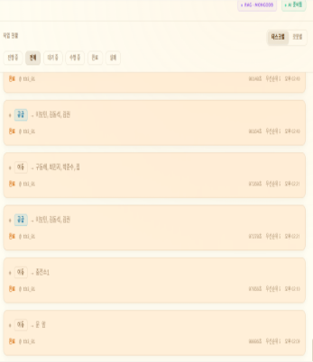 
>        <b>작업별/로봇별 현황</b>
>      </td>  
>    </tr>
>    <tr>
>      <td align="center" width="30%">
>        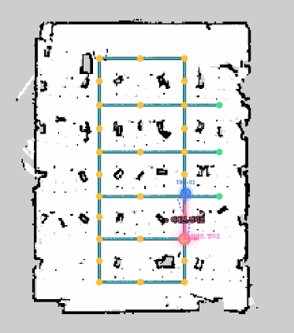 
>        <b>이동경로 확인</b>
>      </td>
>      <td align="center" width="30%">
>        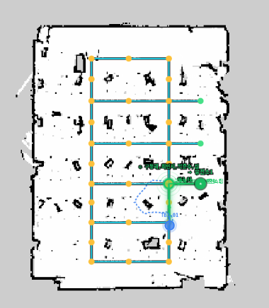 
>        <b>충전경로 확인</b>
>      </td>  
>      <td align="center" width="30%">
>        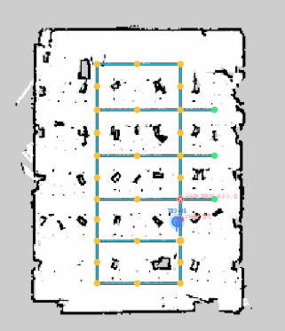 
>        <b>전복 시 표시</b>
>      </td>  
>   </tr>
>  </table>
> 

## 🛠️ 하드웨어

  
HW
 
  
  ### 터틀봇
> |부품명|역할|
> |------|------|
> |USB 2.0 WebCAM  |요구조자 식별 및 관제|
> |WS2812B 고휘도 LED     |전조등|
> |NMP441 전방향 마이크 모듈       |요구조자와 소통|
> |MAX98357a 앰프 + 스피커     |전달 내용 출력|
> |HAM4311 IR 감지기        |라인트레이싱|
>
>  

>  <table>
>    <tr>
>      <td align="center" width="50%">
>        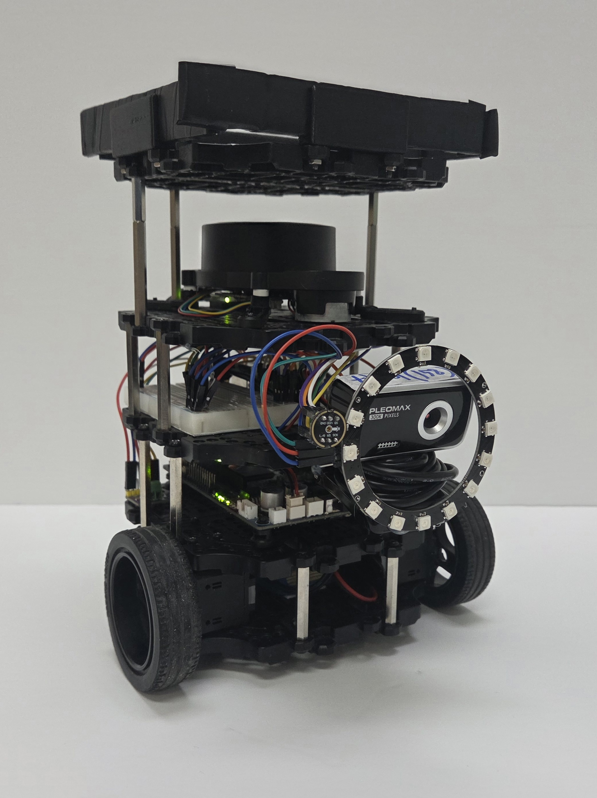 
>        <b>전조등 OFF</b>
>      </td>
>      <td align="center" width="50%">
>        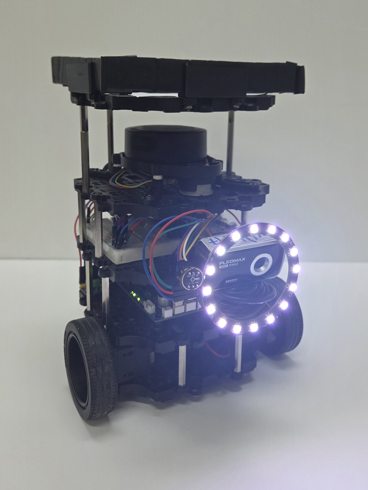 
>        <b>전조등 ON</b>
>      </td>
>    </tr>
>    <tr>
>      <td align="center" width="50%">
>        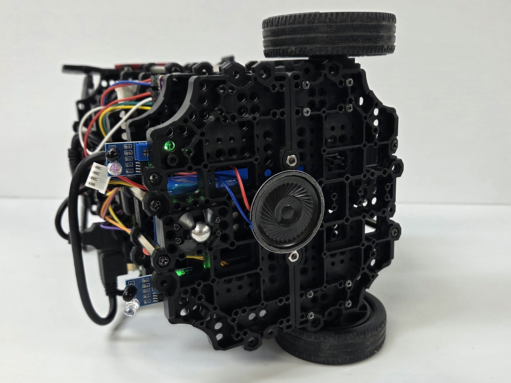 
>        <b>스피커</b>
>      </td>
>      <td align="center" width="50%">
>        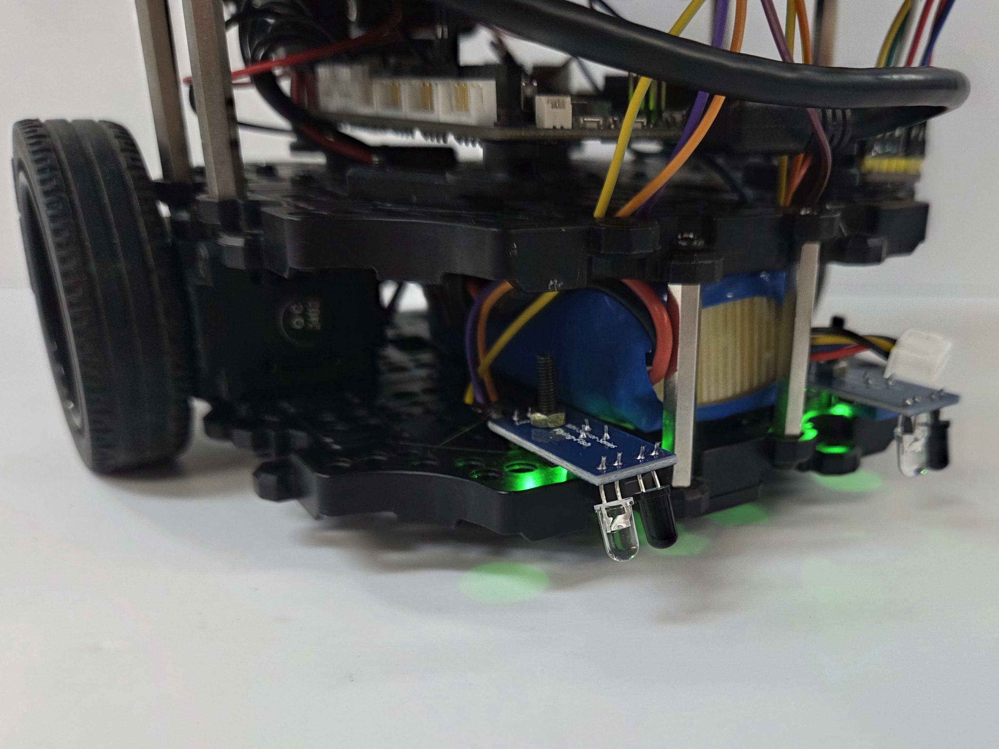 
>        <b>IR 센서</b>
>      </td>
>    </tr>
>    <tr>
>      <td align="center" width="50%">
>        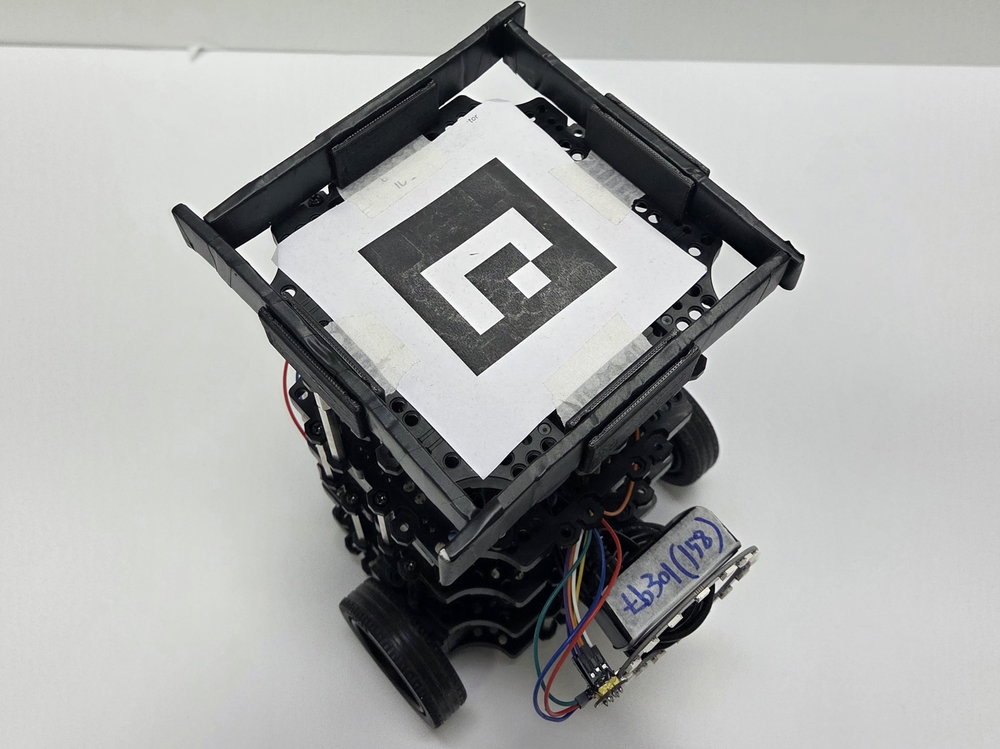 
>        <b>상단 arUco 마커</b>
>      </td>
>   </tr>
>  </table>
> 

  ### 빅핑키
> |부품명|역할|
> |------|------|
> |USB 2.0 WebCAM  |주행용 카메라, 주차용 내부 카메라|
> |Intel RealSense D435i    |매니퓰레이터 추론용 카메라|
> |DYNAMIXEL 모터       |상하차용 경사로 제어 모터|
> |OMX Manipulator     |구호품 적재용 매니퓰레이터|
> 
> 

>  <table>
>    <tr>
>      <td align="center" width="50%">
>        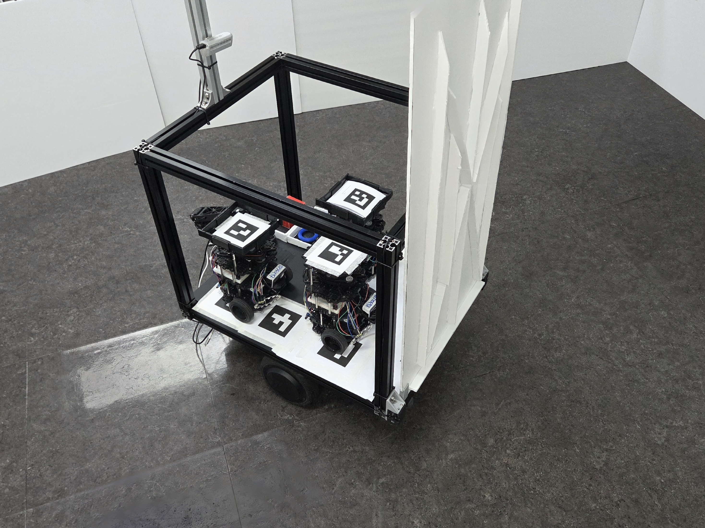 
>        <b>경사로 닫힘</b>
>      </td>
>      <td align="center" width="50%">
>        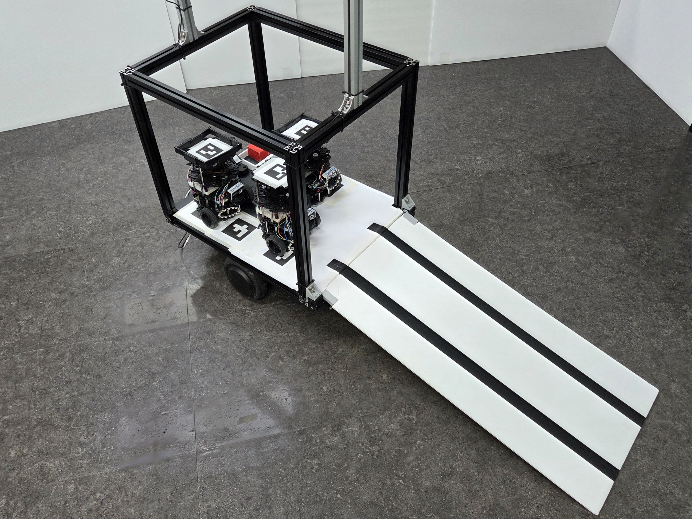 
>        <b>경사로 열림</b>
>      </td>
>    </tr>
>  </table>
> 

>
> 

>  <table>
>    <tr>
>      <td align="center" width="33%">
>        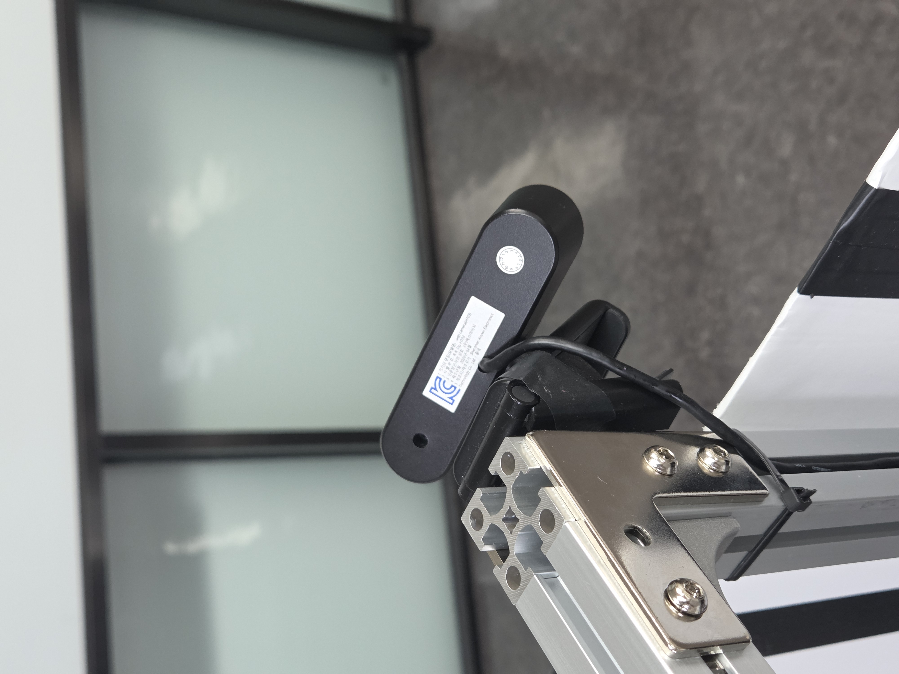 
>        <b>전방 카메라</b>
>      </td>
>      <td align="center" width="33%">
>        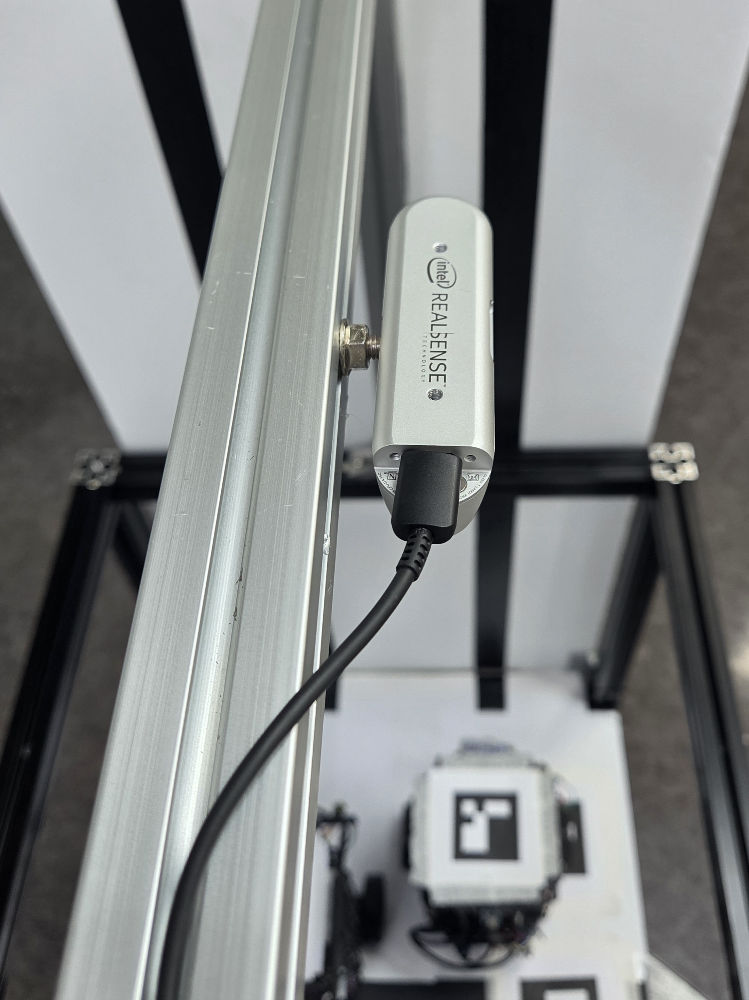 
>        <b>내부 카메라</b>
>      </td>
>      <td align="center" width="33%">
>        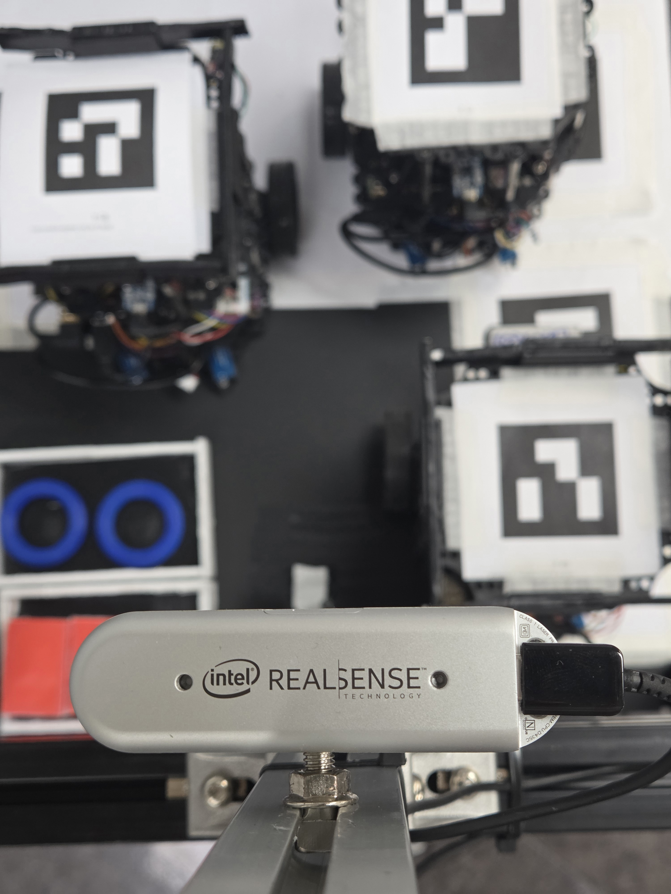 
>        <b>OMX 카메라</b>
>      </td>
>    </tr>
>  </table>
> 

## 🛠️ 소프트웨어

  
SW
 
  
### 경사로 기능 구현
#### 1️⃣Dynamixel SDK 드라이버 구현
> - 모터 초기화, 속도.가속도 프로파일 설정, 부하값 읽기 등 경사로 제어에 필수적인 기능만 갖춘 드라이버 개발
> - GroupSyncWrite 및 GroupSyncRead를 적용하여 좌우 모터가 완벽하게 대칭으로 동작

#### 2️⃣ROS2 멀티스레딩 및 액션 서버 기반 아키텍처
> - 작업이 단발성 멸령이 아닌 시간이 소요되는 작업임을 고려하여 ROS2 액션 서버로 구현
> - 액션이 샐행되는 도중에도 로봇의 상태 퍼블리시와 하드웨어 모니터링이 끊기지 않도록 MultiThreadedExecutor 도입
> - Timer와 Action의 CallbackGroup을 분리하여 안정적인 동시성 제어 구현

#### 3️⃣실시간 부하 모니터링 기반 지형 적응형 제어
> - 부하값이 특정 임계치(100)을 7사이클 이상 초과하면 지면에 닿은 것으로 판단하여 동작 조기 중지
> - 잔여 부하량에 비례하여 목표 각도를 살짝 풀어주어 기구학적 스트레스 완

### 마커 기반 자율 주차
#### 1️⃣유한 상태 기계 기반 기구학적 도킹 알고리즘
> - 로봇의 궤적이 틀어지는 것을 방지하기 위해 마커 후방에 가상의 진입 게이트 생성
> - 로봇의 전방축 투영 연산을 통해 위치 파악
> - 전진 또는 후진 진입을 동적으로 결정하는 적응형 궤적 추적 로직 구현

#### 2️⃣ROS2 비동기 아키텍처 및 다중 로봇 통제
> - 주차가 완료될 때까지 메인 스레드가 멈추는 것을 방지하기 위해 ROS2 액션 서버 도입
> - 액션 피드백을 처리하는 동안에도 카메라 비전 제어 루프가 지연없이 병렬 처리
> - 로봇별 고유 ID와 주차 스팟 ID를 매핑하고 특정 터틀봇에만 제어 명령을 발행

### Autonomous SLAM
#### 1️⃣프론티어 탐지 기반 자율 탐사
> - 맵 토픽의 Grid 데이터를 Numpy 배열로 변환하여 미지 영역과 이동 가능 영역의 경계를 직접 연산하는 프론티어 탐지 알고리즘
> - 센서 노이즈로 발생하는 1~2칸짜리 가짜 프론티어를 군집화 알고리즘을 적용하여 걸러냄
> - 형태학적 팽창 기법을 통해 로봇이 장애물과 충분한 안전거리를 확보할 수 있는 안전한 탐색 목표점만 추출

#### 2️⃣금지 구역 할당
> - 로봇이 탐사를 시작하는 최초의 위치와 헤딩 벡터를 캡처하여 Bounding Box로 수식화
> - 벡터 내적 및 외적 연산을 통해 해당 영역은 탐색 후보 제외

#### 3️⃣무한 루프 방지 시스템
> - 특정 목표 도달에 반복 실패할 경우 해당 좌표 반경을 블랙리스트 처리 후 목표 전환
> - Localization이 지연되거나 소실될 경우 주행을 중단하고 회복을 대기하거나 맵을 자동 저장 후 종료

#### 4️⃣외부 인터럽트 및 비동기 액션 제어
> - 비전 노드에서 조난자 후보를 발견하면 Nav2 액션 서버에 취소 명령을 비동기로 전송하여 로봇 상태 전환
> - 확정 신호나 오탐 신호가 수신되지 않으면 교착 상태에 빠지지 않고 스스로 탐사를 재개

### 조난자 인식 YOLO 모델
#### 1️⃣엣지 컴퓨팅 기반 추론
> - 라즈베리파이의 제한된 연산 자원내에서 실시간 객체 인식이 가능하도록 YOLO 모델을 ONNX 포맷으로 경량화
> - 라즈베리파이에서 추론을 완료하고 인식된 좌표와 데이터만 메세지로 발행하는 구조
#### 2️⃣영상 전, 후처리 및 NMS 알고리즘
> - 모델 입력 320x320
> - conf 0.45 미만의 노이즈 걸러내고 cv2.dnn.NMSBoxes를 통해 겹치는 박스 제거
#### 3️⃣인식-응시-회피
> - 사람 형태가 인식되면 Nav2 주행을 비동기로 즉각 취소
> - 자리에 멈춰 대상을 응시하는 타임아웃 관제 시스템
> - 조난자 위치를 기반으로 점군(PointCloud2)을 동적으로 생성해 Nav2 Costmap에 장애물로 표시

### 구호 물품 적재 시스템
#### 1️⃣초기화 및 모니터링 대기
> - 카메라가 별도의 스레드로 즉기 가동하여 프레임 수집
> - 노드가 활성화되어 추론 시작 토픽을 대기
#### 2️⃣ 추론 시작 및 자원 매핑
> - 노드가 신호를 수신하면 작업에 맞는 모델 매핑
> - 대기 중인 푸론 루프에 이벤트를 발생시켜 추론 시작
#### 3️⃣분산 추론 및 제어
> - 라즈베리파이의 연산 한계를 극복하기 위해 제어와 추론을 분리하여 수행
> - runpy를 통해 카메라 프레임 GPU 서버로 전송
> - GPU 서버에서 계산된 제어 명령을 받아 로봇팔 모터 제어
#### 4️⃣비전 기반 상태 평가
> - 전면 카메라 내에서 HSV 색공간 변환을 통해 구호물품 유무, 적재 유무를 계산
> - 오작동을 막기 위해 감지가 일정 시간 지속되어야만 유효한 상태 변화로 확정
#### 5️⃣자율 종료 및 안전 제어
> - 물체가 적재되고 로봇팔이 중심 위치에 정렬하면 추론 종료 이벤트 발생
> - 스레드가 즉각적으로 인터럽트를 호출하여 비동기 추론 루프 즉시 중단

### 관제 시스템
#### 1️⃣Fleet Management System
> - 현장의 상황을 파악하고 로봇들의 상태를 모니터링 및 제어할 수 있는 통합 관제 시스템
> - 수집된 맵을 노드, 엣지 그래프로 관리
> - 관리자나 AI가 task를 생성하면 적합한 로봇에 배차해 최단경로로 자동 주행
> - 경로상 노드 점유를 감지하여 충돌 방지, 로봇 우회 등 상황도 스스로 감지하여 task 스케줄링
#### 2️⃣다중 로봇 확장성 확보
> - 로봇 각각의 도메인 아이디 설정하여 통신 격리
> - 허브 도메인에서 ROS2 브릿지 서버를 통해 ROS2 통신을 WebSocket으로 변환하여 백엔드와 프론트엔드로 연
#### 3️⃣Task Manager 서비스
> - 단건, 연속, 시나리오, 자동화 등 모든 작업 지시는 하나의 실행 파이프라인으로 수렴
> - 이동, 구호, 공급, 충전, 복귀, 일시정지로 세분화되며 각 타입에 맞는 핸들러가 ROS 메세지 발행
> - 온라인 -> 비작업중 -> 배터리 -> 최단 거리 순의 우선순위 알고리즘을 통해 작업을 수행할 로봇 결정
#### 4️⃣트래픽 매니저
> - 경로상 다음 노드를 타겟으로 하거나 1.5m 이내로 근접한 두 로봇이 발행하면 Tick에서 이를 평가
> - 작업 중요도 -> 작업 착수 시간 -> 로봇 ID 순으로 순서를 매겨 우선권이 낮은 로봇에서 즉각 정지 명령
> - 로봇이 특정 노드에 도착하는 시점에 해당 노드를 점유 처리
> - 점유된 노드나 수동으로 잠근 노드를 제외하고 경로를 계산

## 🚨 트러블슈팅

